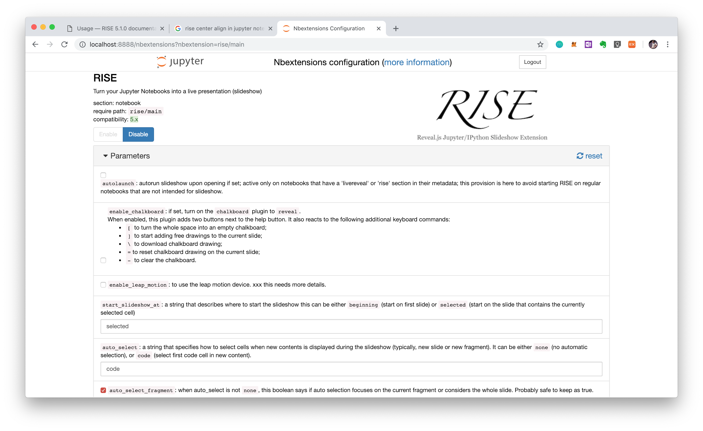

# Python 101 

written by 7akikim

## 개요

본 Python 강의자료는 [HPHK](https://hphk.io)의 강의를 위해 작성되었으며, 외부 유출을 금합니다. 

## Python 환경설정

python version 3.6.7을 기준으로 작성되었음. 

* 윈도우 환경설정 
  1) [공식 홈페이지](https://www.python.org/downloads/release/python-367/) 설치

  * Chocolatey의 경우 다수의 인원이 동시에 접속시 문제가 생기며, 버전 관리는 차후에 진행함.
  * 설치 과정에서 **반드시 Path 설정**을 진행할 것!

  2) Git bash 적용시 아래의 명령어를 통해 python 인터프리터를 실행 할 수 있도록 설정.

  ```powershell
  $ echo "alias python='winpty python.exe'" >> ~/.bash_profile
  $ source ~/.bash_profile
  ```

* C9 환경설정 :  `pyenv`

  1) 아래의 스크립트 실행(복붙) : [gist 링크](https://zzu.li/c9)

  ```powershell
  git clone https://github.com/pyenv/pyenv.git ~/.pyenv
  echo 'export PYENV_ROOT="$HOME/.pyenv"' >> ~/.bashrc
  echo 'export PATH="$PYENV_ROOT/bin:$PATH"' >> ~/.bashrc
  echo -e 'if command -v pyenv 1>/dev/null 2>&1; then\n  eval "$(pyenv init -)"\nfi' >> ~/.bashrc
  
  source ~/.bashrc
  pyenv install 3.6.7
  pyenv global 3.6.7
  python -V
  pip install --upgrade pip
  ```

* MAC 환경설정 : `pyenv` + `homebrew` 

  1) 아래의 스크립트 실행

  ```powershell
  /usr/bin/ruby -e "$(curl -fsSL https://raw.githubusercontent.com/Homebrew/install/master/install)"
  brew update
  brew install pyenv
  echo 'export PYENV_ROOT="$HOME/.pyenv"' >> ~/.bashrc
  echo 'export PATH="$PYENV_ROOT/bin:$PATH"' >> ~/.bashrc
  echo -e 'if command -v pyenv 1>/dev/null 2>&1; then\n  eval "$(pyenv init -)"\nfi' >> 
  exec "$SHELL"
  pyenv install 3.6.7
  pyenv global 3.6.7
  python -V
  pip install --upgrade pip
  source ~/.bashrc
  ```


## Jupyter notebook 환경설정

본 주피터 노트북은 슬라이드 쇼로 활용할 수 있도록 구성하였음. 

> 주피터 nbcoverter의 경우 기본으로 내장되어 있으나, 확장프로그램인 RISE를 설치하여 구성함. 
>
> Reveal.js IPython Slideshow Extension의 줄임말로, 더 편하게 쓸 수 있도록 만들어주며, 주피터 노트북 안에서 바로 슬라이드 쇼 모드가 가능하며, 슬라이드 쇼내에서 코드 실행 가능함.

### 0) Jupyter notebook 설치

```powershell
$ pip install jupyter
```

### 1) [RISE](https://github.com/damianavila/RISE) 설치

(1) pip를 통한 패키지 설치

```powershell
$ pip install rise
```

(2) JS, CSS 파일 설치 

```powershell
$ jupyter-nbextension install rise --py --sys-prefix
$ jupyter-nbextension enable rise --py --sys-prefix
```

(3) 활용

`ALT+R` 단축키를 통해 슬라이드 쇼 모드로 바꿀 수 있음

### 2) 추가 확장 프로그램 설치

> 확장 프로그램은 [링크](https://jupyter-contrib-nbextensions.readthedocs.io/en/latest/index.html)를 통해 확인 가능하다. 
>
> 일부 확장 프로그램은 pip 추가 설치 해야하는 경우도 있다.

(1) pip를 통한 패키지 설치

```powershell
$ pip install jupyter_contrib_nbextensions
```

(2) JS, CSS 파일 설치

```powershell
$ jupyter contrib nbextension install --user
```

(3) 확장프로그램 목록 확인

http://localhost:8888/nbextensions

* 사용중인 확장 프로그램
  * Table of Contents (필수)
  * ~~Table Beautifier (선택)~~ 이거 하니까 더 별로임


## RISE 활용 관련 팁!!

### 1. 슬라이드 실행과정 코드 실행이 안되는 경우(혹은 클릭 해야하는 경우)

혹시 슬라이드를 활용하는 과정에서 코드가 실행이 안된다면, (혹시나 모르니 jupyter notebook 재실행 추천)

이후 http://localhost:8888/nbextensions 들어가서, RISE 확인



* 위에 스샷에서 `auto_select` code로 되어있는지 반드시 확인할 것!!! 
* 이외에 자잘한 버그는 대부분 주피터 노트북 재실행할 것.
* 해상도 조절은 최대한 chrome에서 `cmd` `+` 혹은 `-` 로 조정하면서 볼 것.\

### 2. 슬라이드 이미지 가운데 정렬이 안되는 경우

마크다운이 기본적으로 좌측정렬을 하기 때문에, 가운데 정렬이 되지 않음. 

따라서 아래의 html 코드로 입력하였음. 

```html
<center>
    
</center>
```

### 3. RISE slides to PDF

1. 아래의 코드 실행

```powershell
$ jupyter nbconvert --to slides 파일명.ipynb --post serve
```

2. url 뒤에 `?print-pdf` 붙이기

http://127.0.0.1:8000/your_talk.slides.html?print-pdf

3. 출력
   * 출력 옵션에서 머리말/꼬리말 없애야 깔끔합니다. 
   * 마진이나 layout도 맞게 설정하세요.
## 목차

1. [Intro to Python](./01_Python_intro.ipynb)

   1. 파이썬 기초

     * 식별자
     * 기초 문법
     * 
   2. 변수 및 자료형 

     * 수치형(numbers)
     * Bool
     * None
     * 문자형(string)
   3. 연산자

     * 산술 연산자
     * 비교 연산자
     * 논리 연산자
     * 복합 연산자
     * 기타 연산자
     * 연산자 우선순위
   4. 기초 형변환
   5. 시퀀스 자료형
     * 리스트
     * 튜플
     * 레인지
   6. set, dictionary
      * set
      * dictionary

2. Control of Flow

   1. 조건문 
   2. 반복문
   3. 함수

3. Data Structures 

   1. Lists
   2. Tuples/Sequences
   3. Sets
   4. Dictionaries

4. Control of Flow with Data Structures

5. Error and Exceptions

6. Classes

## License

[Python 라이선스 정책](https://docs.python.org/3/license.html)을 따라 GPL-3.0을 따릅니다. 

본 강의자료는 [Python Tutorial](https://docs.python.org/3.6/tutorial/index.html)를 참조하여 만들어졌습니다.
